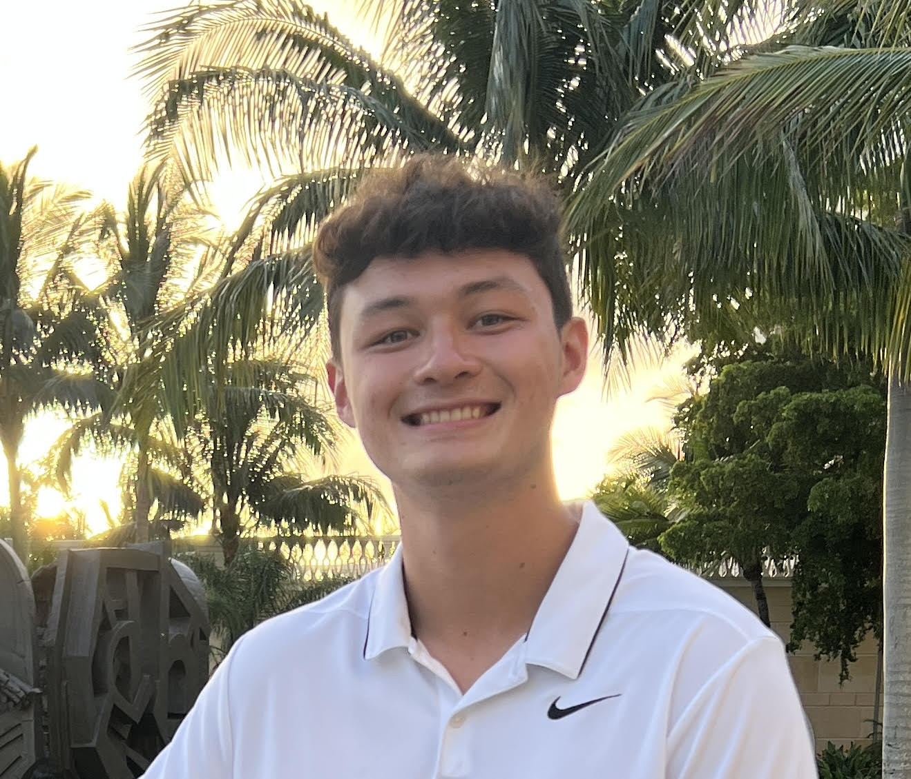

# Thomas' User Page

[Information About Me](#about-me)

[Programming Goals](#computer-science-related-info)

[Published GitHub Page](#published-github-page-link)

## About Me
Hey! My name is Thomas Rexin and I'm a second-year Computer Science major at UCSD. In addition to my course load, I am also tutoring for **CSE 8A** this quarter and participating in the **Early Research Scholars Program** this year.

> My LinkedIn is [here](https://www.linkedin.com/in/thomas-rexin/). 

Some of my interests outside of computer science are:

- Going to the gym
- Playing basketball
- Going out with my friends

## Computer Science Related Info
As a programmer, I am looking forward to becoming more familiar with `git` commands through this class and building upon my learning from previous courses.

My goals for this quarter in CSE 110 are to:

- [ ] Learn more about how it is like working as a software engineer in an industry job
- [ ] Improve on the soft skills that are crucial to being a successful software engineer
- [ ] Contribute to and develop a successful final project with my team

Fun Fact: My ranking of top three programming languages would be:

1. Python
2. Java
3. C++

## Published GitHub Page Link
Follow this [link](README.md) to go to the README.md file with my published GitHub Page.